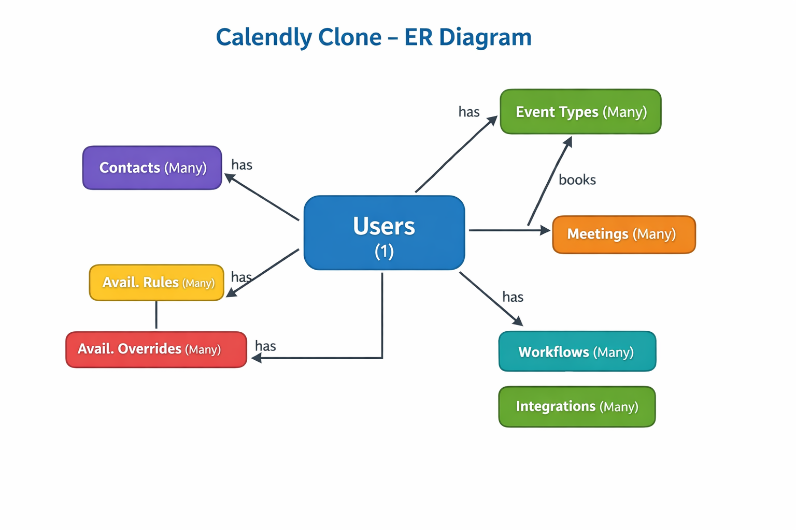
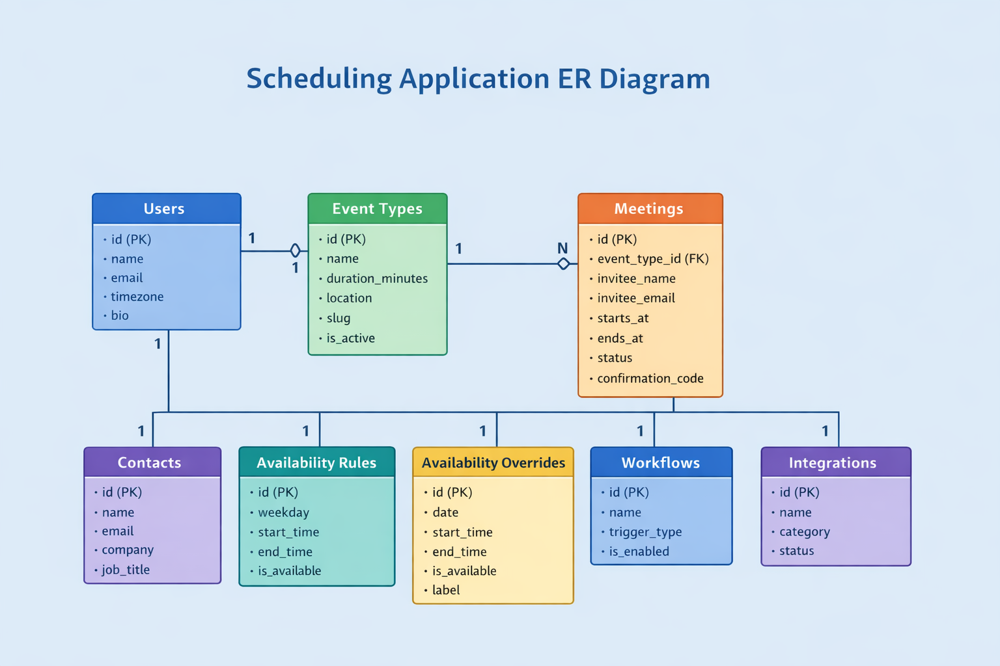

#  Calendly Clone – Implementation Plan

##  Project Overview

This project is a **Calendly-like scheduling system** designed to simplify meeting coordination by eliminating back-and-forth communication.

Users can:
- Create event types (e.g., 15-min call, 30-min meeting)
- Share booking links
- Allow invitees to schedule meetings
- Manage availability and workflows

This system replicates the core idea of scheduling platforms like Calendly, where users share available time slots and others can book meetings seamlessly. :contentReference[oaicite:0]{index=0}

---

##  Objectives

- Automate meeting scheduling
- Reduce manual coordination effort
- Provide structured availability management
- Enable integrations (Zoom, Google Meet, etc.)
- Support workflow automation (reminders, follow-ups)

---

##  System Architecture

The system follows a **user-centric relational database design**.

### ER Relationship Structure

###  Key Relationships

- One **user → many event types**
- One **event type → many meetings**
- One **user → many meetings**
- All entities are **dependent on the user**

 This ensures:
- Data isolation per user
- Scalability
- Clean relational structure

---

##  Database Design

### 1.  Users Table

Stores user profile and identity information.

**Fields:**
- `id` – Primary key
- `name`
- `email` (unique)
- `timezone`
- `bio`

**Purpose:**
- Central entity of the system
- All other tables reference this

---

### 2.  Event Types

Defines different meeting types.

**Examples:**
- 15-minute intro call
- 30-minute meeting
- 45-minute strategy session

**Fields:**
- `name`, `slug`
- `duration_minutes`
- `location` (Zoom / Meet / Phone)
- `buffer_before`, `buffer_after`

**Purpose:**
- Acts like a **booking template**
- Determines meeting structure

---

### 3.  Meetings

Stores all scheduled meetings.

**Fields:**
- `invitee_name`, `invitee_email`
- `starts_at`, `ends_at`
- `status` (scheduled, completed, cancelled)
- `confirmation_code`

**Purpose:**
- Core transactional table
- Tracks all bookings

---

### 4.  Contacts

Stores people the user interacts with.

**Fields:**
- `name`, `email`
- `company`, `job_title`

**Purpose:**
- Acts like a lightweight CRM
- Stores meeting participants

---

### 5.  Availability Rules

Defines weekly availability.

**Example:**
- Monday–Friday → 9:00 AM to 5:00 PM

**Fields:**
- `weekday`
- `start_time`, `end_time`
- `is_available`

**Purpose:**
- Recurring availability logic

---

### 6.  Availability Overrides

Handles exceptions.

**Examples:**
- Holidays
- Special working hours
- Out-of-office days

**Fields:**
- `date`
- `is_available`
- `label`

**Purpose:**
- Overrides default availability rules

---

### 7.  Workflows

Automates actions related to meetings.

**Examples:**
- Send reminder email
- Send thank-you message
- Notify cancellation

**Fields:**
- `name`
- `trigger_type`
- `is_enabled`

**Purpose:**
- Improves automation and user experience

---

### 8.  Integrations

Stores external service connections.

**Examples:**
- Google Calendar
- Zoom
- Slack

**Fields:**
- `name`
- `category`
- `status`

**Purpose:**
- Enables real-world usability
- Prevents double booking via calendar sync

---

## 3 Functional Flow

### 1. User Registration & Login
- User creates account
- Stores profile in `users`

---

### 2. Create Event Type
- User defines meeting type
- Stored in `event_types`

---

### 3. Set Availability
- Weekly schedule → `availability_rules`
- Exceptions → `availability_overrides`

---

### 4. Share Booking Link
- Based on `event_type.slug`

---

### 5. Invitee Books Meeting
- System checks availability
- Creates entry in `meetings`

---

### 6. Workflow Execution
- Triggers:
  - Email reminders
  - Notifications

---

### 7. Integration Sync
- Sync with external calendars
- Avoid conflicts

---

##  Tech Stack (Typical for this project)

Based on repository structure and common implementation:

### Frontend
- HTML, CSS, JavaScript
- React (for UI components)

### Backend
- Node.js / Express OR Python (depending on implementation)

### Database
- SQLite (lightweight, file-based)

### Integrations
- Google Calendar API
- Zoom / Meet APIs

---

##  Key Features

- User authentication
- Event type creation
- Smart scheduling system
- Availability management
- Meeting lifecycle tracking
- Workflow automation
- Third-party integrations

---

##  Advantages of Design

- Modular architecture
- Scalable database design
- User-centric data isolation
- Easy integration support
- Extensible workflows

---

##  Limitations

- No real-time conflict detection (if not implemented)
- Limited UI/UX (depending on frontend)
- Requires external APIs for full functionality

---

##  Future Enhancements

- AI-based scheduling suggestions
- Real-time availability updates
- Payment integration (Stripe)
- Team scheduling support
- Analytics dashboard

---

##  Conclusion

This project successfully demonstrates:

- A **complete scheduling system**
- Strong **database design principles**
- Real-world applicability similar to Calendly

It showcases how meeting automation platforms work internally and how different modules interact to provide a seamless scheduling experience.

---
